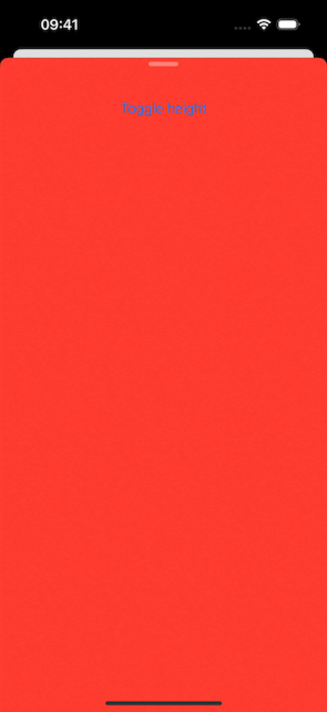
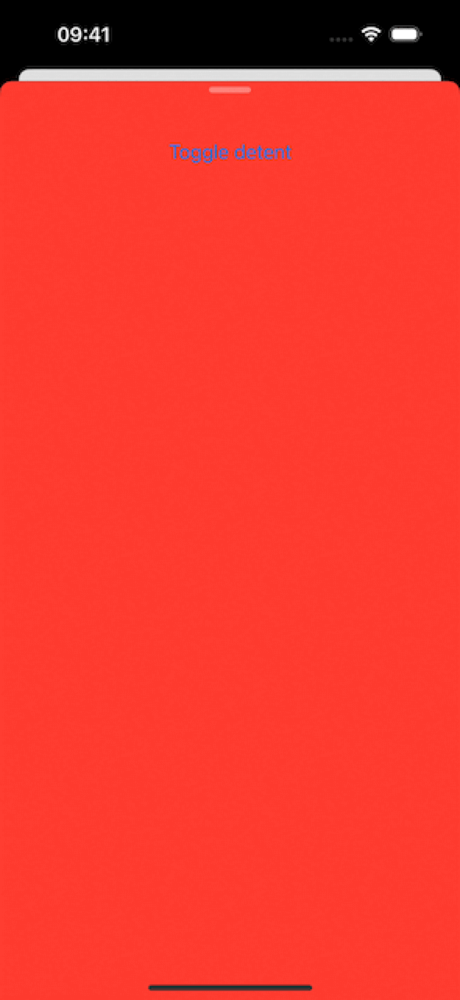

# Sheet background doesn't reach bottom when programmatically changing detent

## Basic Information
### Which platform is most relevant for your report?
iOS

### Which technology does your report involve?
SwiftUI

### What type of feedback are you reporting?
Incorrect/Unexpected Behavior

### What build does the issue occur on?
iOS 17.4 Seed 3 (21E5200d)

### Where does the issue occur?
On device

## Description
- Run the given code.
- Make sure the sheet is presented.
- Press "Toggle detent" to toggle the sheet detent.
- When going from a larger detent to a shorter detent, the background of the sheet doesn't reach the bottom of the screen.
- Unexpectedly, we can see a gap during the animation. This gap should not exist.
- See the attached workaround, where extra padding is added to the bottom of the background.

## Evidence
### GIFs
| Demo | Workaround |
|:-:|:-:|
|  |  |

### Code
https://github.com/GeorgeElsham/AppleFeedback/blob/da7293009d5709c96a34557e4ff073a29ea5659b/FB13705098/demo.swift#L1-L34

https://github.com/GeorgeElsham/AppleFeedback/blob/da7293009d5709c96a34557e4ff073a29ea5659b/FB13705098/workaround.swift#L1-L35
