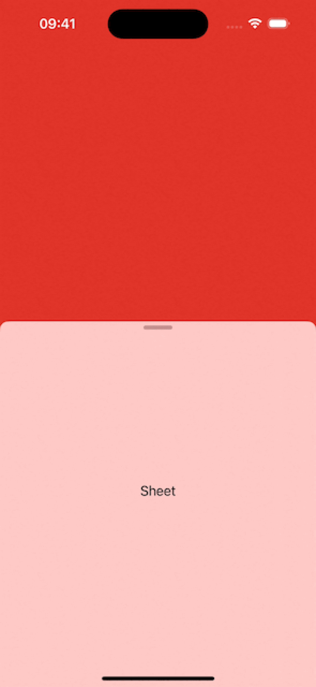

# Sheet background flashes when changing detents

## Basic Information
### Which platform is most relevant for your report?
iOS

### Which technology does your report involve?
SwiftUI

### What type of feedback are you reporting?
Incorrect/Unexpected Behavior

### What build does the issue occur on?
iOS 17.4 Seed 3 (21E5200d)

### Where does the issue occur?
On device

## Description
- Run the given code.
- Drag the sheet up and down.
- Notice that the background of the sheet flashes, when the background is partially transparent.
- I would expect the background of the sheet not to flash.
- Moving the `SheetView` into `ContentView` seems to reduce the _chances_ of it happening, but doesn't solve the problem.
- Can use [SwiftUIIntrospect](https://github.com/siteline/swiftui-introspect) as a workaround.

## Evidence
### GIFs
| Demo | Workaround |
|:-:|:-:|
|  |  |

### Code
https://github.com/GeorgeElsham/AppleFeedback/blob/5b5f40db714bda75be091efa08eb6220bc9787e8/FB13705157/demo.swift#L1-L30

https://github.com/GeorgeElsham/AppleFeedback/blob/5b5f40db714bda75be091efa08eb6220bc9787e8/FB13705157/workaround.swift#L1-L34
