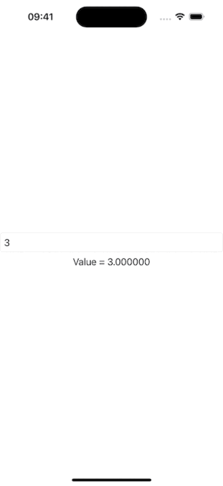

# TextField binded value stops changing after field is empty

## Basic Information
### Which platform is most relevant for your report?
iOS

### Which technology does your report involve?
SwiftUI

### What type of feedback are you reporting?
Incorrect/Unexpected Behavior

### What build does the issue occur on?
iOS 17.4 Seed 3 (21E5200d)

### Where does the issue occur?
On device

## Description
- Run the given code.
- Try typing some numbers, and see the binded value update.
- Delete the numbers until the field is empty. The value is correctly set to `nil`.
- Try typing some numbers again, but this time the binded value won't update.
- I would correctly expect the binded value to be set to `nil` when empty, but I would also expect the input to work just as normal after.

## Evidence
### GIFs
| Demo | Workaround |
|:-:|:-:|
|  |  |

### Code
https://github.com/GeorgeElsham/AppleFeedback/blob/52c4eac6a9f8884348b2b65be68fd4ad95c6deb1/FB13705327/demo.swift#L1-L29

https://github.com/GeorgeElsham/AppleFeedback/blob/52c4eac6a9f8884348b2b65be68fd4ad95c6deb1/FB13705327/workaround.swift#L1-L49
