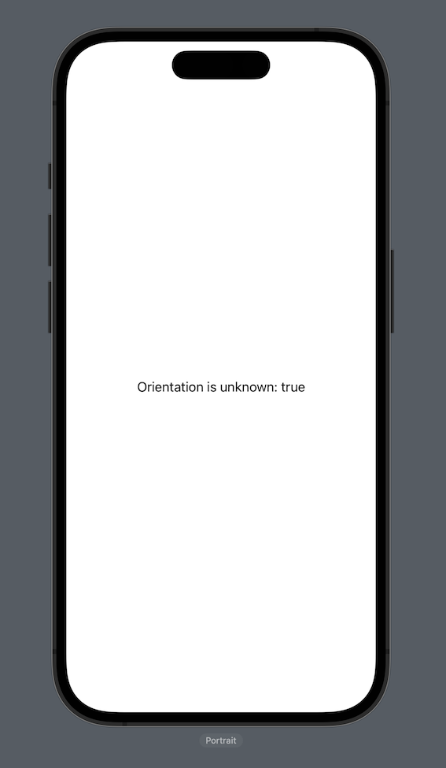

# Xcode previews device orientation is reported as unknown

## Basic Information
### Please provide a descriptive title for your feedback:
Xcode previews device orientation is reported as unknown

### Which area are you seeing an issue with?
Simulator

### What type of feedback are you reporting?
Incorrect/Unexpected Behavior

## Details
### Did you see an error message?
No

### What time did the issue occur?
1 May 2024 at 21:14

### What devices were you using when the issue occurred?
iOS or iPadOS device

## Description
- Run the given code.
- Use "Canvas" / Xcode previews.
- See orientation is unknown.
- In some cases, the orientation may not be reported as unknown. However, after a canvas refresh, it can become unknown again. When switching to one of the landscape orientations, sometimes it may be the correct orientation, and then become unknown when the canvas is refreshed again.

## Evidence
### Visual
| Demo | Workaround |
|:-:|:-:|
|  | Unknown |

### Code
